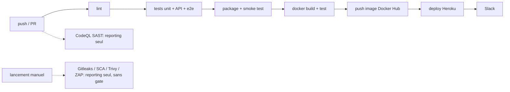

# Analyse du pipeline existant (« as-is ») — brief §2

Objectif : cartographier le pipeline **avant** nos modifications, lister les outils déjà en place,
repérer les faiblesses de sécurité, et conserver cet état des lieux pour le comparer à l'état cible
(« to-be », voir [`devsecops.md`](./devsecops.md)).

**Périmètre.** Le projet importe OWASP Juice Shop, une application volontairement vulnérable. Son
CI/CD d'origine est **GitHub Actions** (une vingtaine de fichiers dans `.github/workflows/`) complété
par un `.gitlab-ci.yml` de 3 lignes. Ces fichiers ont été **supprimés** lors de l'import (marqué par
le tag `baseline`) pour ne pas tourner dans notre dépôt ; l'analyse ci-dessous les décrit tels qu'ils
étaient à ce commit.

## 1. Étapes du pipeline existant

Pipeline principal : `ci.yml` (« CI/CD Pipeline »), sur chaque push et pull request (docs, captures
et traductions exclues).

| Étape | Job(s) | Rôle |
|---|---|---|
| Lint | `lint` | `npm run lint` (ESLint, style de code) |
| Tests unitaires / intégration | `frontend-test`, `server-test`, `api-test` | `npm test` sur Linux/Windows/macOS ; couverture envoyée à Coveralls |
| Tests E2E | `e2e-test`, `custom-config-test` | Cypress sur l'application démarrée |
| Build + packaging | `smoke-test` | `npm install --production`, archive, démarrage, `test/smoke/smoke-test.sh` |
| Build + test conteneur | `docker-test` | `docker compose -f docker-compose.test.yml up` |
| Publication image | `docker` | build et **push** de l'image vers Docker Hub (**uniquement** dépôt officiel, push sur master/develop) |
| Déploiement | `heroku` | déploiement sur Heroku (**uniquement** dépôt officiel) |
| Notification | `notify-slack` | message Slack avec le résultat |

Autres workflows présents :

| Workflow | Déclencheur | Portée sécurité |
|---|---|---|
| `codeql-analysis.yml` | push, PR | **SAST** (CodeQL, `security-extended`). Alimente l'onglet Security ; **ne bloque jamais** |
| `gitleaks.yml` | `workflow_dispatch` (manuel) | Scan de secrets, lancé à la main, sans gate |
| `sca.yml` | `workflow_dispatch` (manuel) | `npm audit --audit-level=high`, à la main |
| `docker-scan.yml` | `workflow_dispatch` (manuel) | Trivy sur une image construite à part (`docker build` local), à la main |
| `zap_scan.yml` | planifié / manuel | **DAST** ZAP baseline, **après** déploiement, avec de nombreuses règles en IGNORE |
| `release.yml` | tag de version | packages multi-OS, image multi-arch vers Docker Hub, Slack |
| `pr-compliance.yml`, `lint-fixer.yml`, `rebase.yml`, `stale.yml`, `lock.yml` | variés | housekeeping / conformité contributeur |
| `image_actions.yml`, `frontend-bundle-analysis.yml`, `update-*.yml` | variés | compression d'images, rapport de bundle, MAJ site/news |
| `.gitlab-ci.yml` | GitLab | template `Auto-DevOps` avec **`TEST_DISABLED` et `DAST_DISABLED`** |

## 2. Outils déjà en place

| Catégorie | Outil | Bloquant ? |
|---|---|---|
| Qualité de code | ESLint | oui (job `lint`) |
| Tests fonctionnels | Node test runner, `ng test`, Cypress, smoke-test | oui |
| SAST | CodeQL (`security-extended`) | **non** |
| DAST | ZAP baseline | **non**, manuel/planifié, **après** déploiement, règles en IGNORE |
| Scan de secrets | Gitleaks (`gitleaks.yml`) | **non**, manuel uniquement |
| SCA | `npm audit` (`sca.yml`) | **non**, manuel uniquement |
| Scan d'image | Trivy (`docker-scan.yml`) | **non**, manuel, image construite à part |
| SBOM | CycloneDX (`npm run sbom` dans le build Docker) | n/a (inventaire) |
| Secrets du pipeline | secrets GitHub chiffrés (Docker Hub, Heroku, Slack…) | bonne pratique |
| Notifications | Slack | oui, sur push |
| MAJ dépendances | Dependabot | **non**, hors pipeline, propose des PR |

## 3. Faiblesses de sécurité identifiées

| # | Faiblesse | Où | Conséquence |
|---|---|---|---|
| W1 | Scans de sécurité **manuels** (`workflow_dispatch`) : rien ne tourne automatiquement à chaque push | `gitleaks/sca/docker-scan/zap_scan.yml` | une faille peut passer si personne ne lance le scan à la main |
| W2 | **Aucune gate de sécurité** entre build et déploiement | `docker` / `heroku` ne dépendent que des tests fonctionnels | un build vulnérable est déployé si les tests passent |
| W3 | Le SAST existe (CodeQL) mais **ne bloque jamais** | `codeql-analysis.yml` | les findings n'arrêtent ni merge ni release |
| W4 | Le DAST tourne **après** déploiement, sur site public, règles désactivées | `zap_scan.yml` | les problèmes sont découverts après exposition des utilisateurs |
| W5 | **Pas de shift-left local** : ni pre-commit hooks, ni règles de sécurité IDE, ni `.vscode` | postes développeurs | les problèmes ne remontent qu'après le push |
| W6 | Scans **dispersés et redondants**, versions d'actions incohérentes (v4 vs v7) | 5+ workflows séparés | aucune vue centralisée, maintenance difficile, résultats non comparables |
| W7 | L'image Docker est **poussée sans scan de vulnérabilité bloquant** | `docker`, `release.yml` | une image critique atteint le registre |
| W8 | `curl https://cli-assets.heroku.com/install.sh \| sh` dans le pipeline | job `heroku` | exécute un script distant non vérifié dans un pipeline qui détient `HEROKU_API_KEY` |
| W9 | Certaines actions référencées par **tag mobile** (`@v2`, `@v3`) | `ci.yml`, `codeql-analysis.yml` | un tag compromis s'exécuterait en CI |
| W10 | La variante GitLab **désactive tests et DAST** | `.gitlab-ci.yml` | le chemin GitLab a encore moins de contrôles |
| W11 | L'application a des vulnérabilités intentionnelles (SQLi, XSS, clés codées en dur) | source | attendu pour une app d'entraînement, mais **rien dans le pipeline ne les signale** |

Note : Juice Shop est *censé* être vulnérable. W11 est le but de l'application ; W1–W10 sont de
vraies faiblesses de pipeline qui concerneraient n'importe quelle application construite ainsi.

## 4. État cible (« to-be ») et traitement de chaque faiblesse

Le pipeline cible est décrit dans [`devsecops.md`](./devsecops.md) : **un seul** `devsecops.yml`, un
job par contrôle de sécurité nommé comme dans le brief, une décision unique (`quality_gate`), un
`build` parallèle aux scans source, et un `deploy` qui promeut le digest scanné sur `main`.

| Faiblesse | Traitée par | Phase |
|---|---|---|
| W1 | Tous les contrôles tournent **automatiquement** à chaque push/PR dans `devsecops.yml` | 1-2 |
| W2 | `quality_gate` : ≥ 1 critique ou ≥ 5 hautes non acceptées = bloqué ; `deploy` ne tourne qu'après | 2-3 |
| W3 | `sast` (Semgrep) **bloque** sur tout nouveau finding depuis `baseline` | 1 |
| W4 | `dast` (ZAP) sur **chaque push** (scan rapide) et chaque semaine (scan complet), **avant** déploiement, sur l'image fraîchement construite | 2 |
| W5 | `.pre-commit-config.yaml` + `.vscode/extensions.json` (shift-left local) | 1 |
| W6 | Consolidation en **un seul** pipeline ; versions d'outils **épinglées** | 1-2 |
| W7 | `docker_scan` (Trivy image + SBOM) avant tout déploiement, résultat dans la gate | 2 |
| W8, W9 | Notre pipeline n'utilise **aucun `curl \| sh`** et épingle les versions ; Checkov analyse nos propres workflows | 1-2 |
| W10 | Non utilisé : nous restons sur **un seul** CI (GitHub Actions) | – |
| W11 | Détecté et corrigé sur une branche dédiée (un commit par CWE) ; le reste est assumé via `baseline` + exemptions | 1 |
