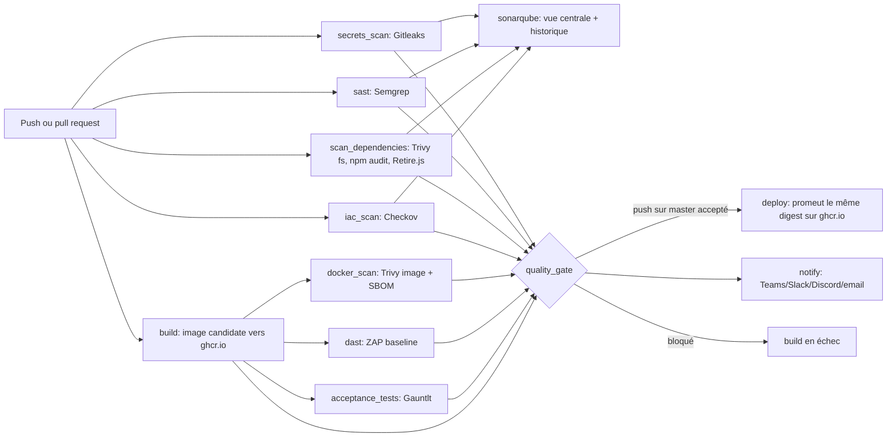

# Pipeline DevSecOps et publication

## État de départ

Le dépôt contient OWASP Juice Shop, une application volontairement vulnérable utilisée pour la
formation. Son workflow historique `.github/workflows/ci.yml` (« CI/CD Pipeline ») faisait déjà lint,
tests unitaires, tests d'intégration, packaging, smoke test et build/test Docker, avec une
publication Docker Hub et un déploiement Heroku **réservés au dépôt officiel** `juice-shop/juice-shop`.
S'y ajoutaient des workflows de sécurité **manuels et dispersés** (`gitleaks.yml`, `sca.yml`,
`docker-scan.yml`, `zap_scan.yml`, `codeql-analysis.yml`), chacun avec ses propres versions d'actions
et sans décision commune. L'analyse détaillée de cet existant est dans [`as-is.md`](./as-is.md).

**Ce projet remplace tout cela par un pipeline de sécurité unique et cohérent.** Les 18 workflows
d'origine ont été supprimés ; il ne reste que `devsecops.yml` (le pipeline) et `semgrep-compare.yml`
(un utilitaire manuel de comparaison de rulesets pour le rapport). Aucun scan n'est donc fait en
double, et une seule décision — le quality gate — conditionne la publication.

## Pipeline cible



Point clé de conception : le **`build` tourne en parallèle des scans source** (il n'a pas de
`needs`). Un finding SAST ou un secret ne doit **pas** empêcher l'image d'être construite, sinon
`docker_scan`, `dast` et `acceptance_tests` ne tourneraient jamais et le quality gate déciderait sur
des rapports incomplets. La compilation de l'application a lieu **une seule fois**, dans le build de
l'image via `security/Dockerfile.acceptance` : il n'y a donc pas de job de build applicatif séparé.

Chaque contrôle d'image (`docker_scan`, `dast`, `acceptance_tests`) tire **le digest exact** produit
par `build`, et `deploy` re-taggue ce même digest : ce qui arrive en production est, par
construction, ce qui a été analysé (« build once, promote »).

## Ce que signifie « déploiement » ici

Le job `deploy` promeut sur GitHub Container Registry l'image qui a été analysée :
`ghcr.io/<propriétaire>/<dépôt>:<commit>` et `:latest`. Il ne redémarre pas un serveur web public et
ne reconstruit rien — il donne les tags de production au digest déjà scanné. C'est la même forme de
publication que le projet de référence.

Les répertoires `infrastructure/` et `infrastructure/terraform/` sont explicitement signalés dans
leur README comme des exemples **volontairement vulnérables** pour les challenges Juice Shop : ne pas
les appliquer pour créer une infrastructure réelle. Checkov les analyse comme IaC (détection de
mauvaises configurations), mais rien ici ne les déploie.

## Configuration GitHub requise

1. **Branche par défaut.** Le workflow se déclenche sur `master` (push) et sur toute pull request. Le
   job `deploy` ne s'exécute que sur un push dans `refs/heads/master`. Vérifier que `master` est bien la
   branche par défaut du dépôt.
2. **Tag `baseline`.** Avant le premier run, marquer le commit de départ (l'import brut de Juice
   Shop) comme référence :

   ```bash
   git tag baseline <SHA_DU_COMMIT_DE_DEPART>
   git push origin baseline
   ```

   Ce tag sert à distinguer les vulnérabilités déjà présentes dans Juice Shop (pédagogiques) des
   **nouvelles** alertes. `secrets_scan` et `sast` ne bloquent que sur du nouveau depuis `baseline`.
3. **Écriture de packages.** Dans **Settings → Actions → General**, autoriser les workflows à écrire
   les packages. `build` et `deploy` demandent `packages: write` avec le `GITHUB_TOKEN` temporaire ;
   aucun token Docker séparé n'est nécessaire.
4. **Secrets facultatifs.** `SONAR_TOKEN` (SonarQube Cloud) : sans lui, le job `sonarqube` est sauté
   proprement et les autres rapports restent disponibles en artefacts. Notifications Teams, Slack,
   Discord, email : facultatives, leurs secrets ne doivent **jamais** être commis dans Git.
5. **SonarQube Cloud** (si utilisé) : créer un projet sur <https://sonarcloud.io> puis renseigner
   `sonar.organization` et `sonar.projectKey` dans `sonar-project.properties`.

La procédure complète d'installation (poste développeur + dépôt) est dans [`SETUP.md`](./SETUP.md).

## Contrôle des vulnérabilités et exemptions

Les seuils de blocage et la procédure d'exemption traçable sont décrits dans
[`security-policy.md`](./security-policy.md). En résumé : corriger d'abord le code ; une exemption
temporaire (`security/accepted-risks.json`) doit avoir un identifiant, une justification, un
responsable et une date d'expiration (≤ 90 jours), relue par l'autre membre du binôme.

### Régénérer la baseline (dérive des dépendances)

Juice Shop est vulnérable *par construction* : sa base de risques connus est figée dans
`security/accepted-risks.json`. Quand les versions des dépendances dérivent, les identifiants des
constats (CVE, règles Checkov, plugins ZAP) ne correspondent plus à cette base et le gate bloque à
nouveau tout, même sans régression réelle. Pour repartir d'un état sain :

1. **Actions → devsecops → Run workflow**, cocher `refresh_baseline` (laisser `full_dast` décoché).
2. Le job `refresh_baseline` (déclenchement manuel uniquement) rejoue `security/gate.py
   --write-baseline` sur les rapports du run en cours et commet le nouveau
   `security/accepted-risks.json` (expiration à 90 jours).
3. Un push ultérieur relit cette base : seuls les constats réellement nouveaux bloquent, et
   `deploy` peut promouvoir l'image.

Remarque : le commit produit par `refresh_baseline` utilise le `GITHUB_TOKEN` du run ; GitHub ne
déclenche volontairement pas de nouveau run pour un push fait avec ce jeton. Il faut donc pousser
(ou relancer) une fois après la régénération pour voir le gate statuer sur la nouvelle base.

## Vérification et preuves à remettre

Après le push, consulter **Actions → devsecops**. Les jobs `secrets_scan`, `sast`,
`scan_dependencies`, `iac_scan`, `sonarqube`, `build`, `docker_scan`, `dast`, `acceptance_tests`,
`quality_gate` et `deploy` donnent l'ordre et le résultat de chaque étape. Télécharger l'artefact
`quality_gate` pour l'attestation, et les artefacts des scanners pour les rapports JSON/HTML et la
SBOM. La liste des captures à produire pour le rapport est dans [`SETUP.md`](./SETUP.md#preuves).

La publication GHCR et le fonctionnement effectif du workflow doivent être confirmés par un run
réussi sur le dépôt GitHub. Ce paquet contient la configuration ; il ne peut pas créer le tag Git ni
modifier les paramètres du dépôt à votre place.
